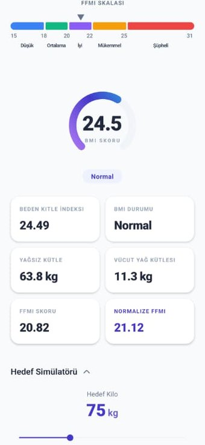
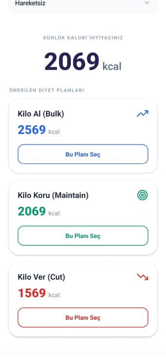
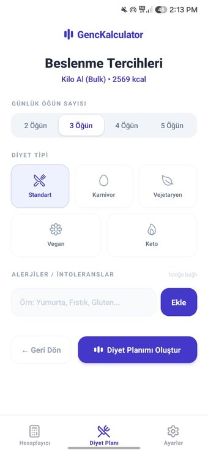
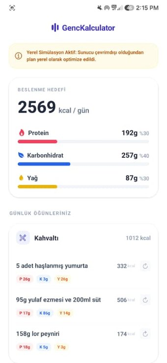
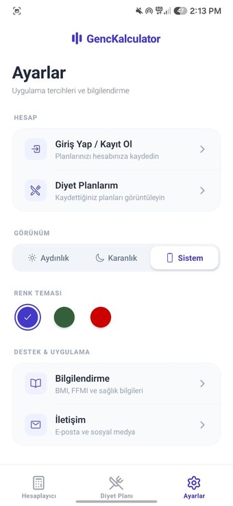
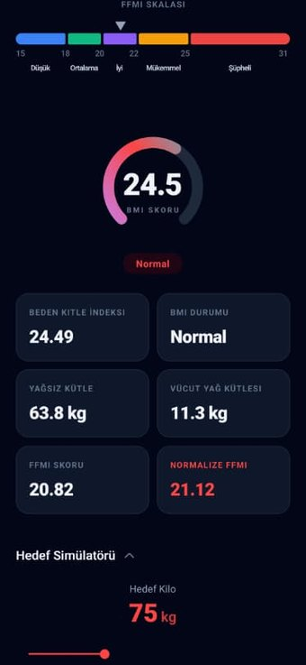
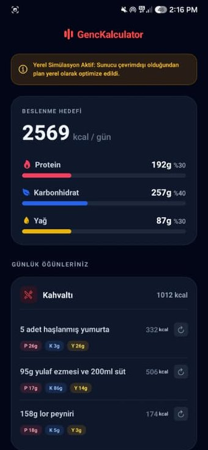
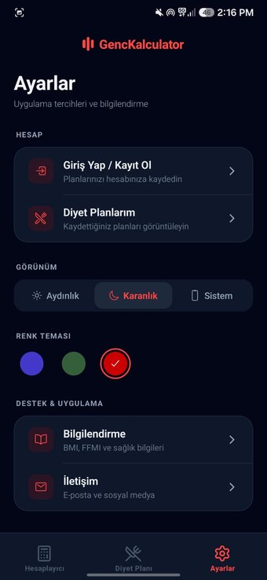

# GençKal Mobile — Beslenme Planlama Uygulaması

Vücut kompozisyonunu hesaplayan, hedefe göre kalori ve makro dağılımı belirleyen ve kişiselleştirilmiş beslenme planı üreten React Native (Expo) mobil uygulaması. GençKal web platformunun mobil istemcisidir.

[Web uygulamasını görüntüle](https://genckal.vercel.app) · [Web deposunu incele](https://github.com/BorBozka/GencKal)

### Ana akış

| Hesaplayıcı | Diyet planı seçimi | Beslenme tercihleri |
| --- | --- | --- |
|  |  |  |

### Üretilen plan ve ayarlar

| Öğün bazında beslenme planı | Uygulama ayarları |
| --- | --- |
|  |  |

### Tema ve renk seçenekleri

Uygulama aydınlık, karanlık ve sistem görünüm modlarını; indigo, orman yeşili ve kırmızı vurgu renklerini destekler. Tercihler cihazda saklanır ve sonraki açılışta hatırlanır.

| Karanlık — hesaplayıcı | Karanlık — üretilen plan | Karanlık — ayarlar |
| --- | --- | --- |
|  |  |  |

> **Güncel durum:** Proje aktif geliştirme aşamasındadır. Hesaplayıcı tamamen cihaz üzerinde çalışır. Beslenme planı üretimi bir backend API üzerinden yapılır; API'ye ulaşılamadığında uygulama yerel plan üreticisine düşerek çalışmaya devam eder. Yukarıdaki plan ekranlarındaki bildirim bu yerel çalışma modunu göstermektedir.

## Problem ve Ürün Yaklaşımı

Mobil kalori uygulamalarının çoğu ya yalnızca bir hesap makinesidir ya da kullanıcıyı doğrudan hazır bir diyet listesine yönlendirir. Aradaki adım — kullanıcının mevcut vücut kompozisyonunu anlaması, buna göre gerçekçi bir hedef seçmesi ve planın o hedeften türetilmesi — genellikle atlanır.

GençKal Mobile bu adımları tek bir akışa bağlar: kullanıcı önce BMI, yağsız kütle ve FFMI değerleriyle mevcut durumunu görür, hedef simülatörüyle farklı hedef kilolarda ne olacağını inceler, ardından bulk / maintain / cut hedeflerinden birini seçer ve beslenme tercihlerini girerek planını üretir.

Mobil sürüm, web platformunun küçültülmüş bir kopyası değil; dokunmatik kullanıma göre yeniden düzenlenmiş bir istemcidir. Kaydırıcı tabanlı girdiler, sekmeli gezinme ve dokunsal geri bildirim mobil bağlama özgü kararlardır.

## Rolüm ve Katkılarım

- Mobil ürünün kapsamını belirledim ve web sürümüyle özellik eşleştirmesini yaptım.
- Hesaplama, hedef simülasyonu, plan seçimi ve tercih girişi akışlarının bilgi yapısını tasarladım.
- Dokunmatik kullanıma uygun girdi yöntemleri ve sekme yapısı hakkında UI/UX kararları aldım.
- Tema ve renk kişiselleştirmesinin kapsamını ve davranışını tanımladım.
- Backend erişilemediğinde uygulamanın kullanılabilir kalması gerektiğine karar verdim; yerel plan üretici davranışını kapsamlandırdım.
- İşleri aşamalara ayırarak görevleri AI ajanlarına tanımladım; çıktıları işlevsel ve görsel gereksinimlere göre değerlendirdim.

> Ürün kararları, kapsam, kullanıcı akışları ve çıktı değerlendirmesi tarafımdan yürütülmüştür. Kod üretimi AI ajanlarıyla gerçekleştirilmiştir.

## Ürün Özellikleri

**Hesaplayıcı**
- Boy, kilo, yaş, cinsiyet, vücut yağ oranı ve aktivite seviyesine göre BMI ve FFMI hesaplama
- Yağsız vücut kütlesi, vücut yağ kütlesi ve normalize FFMI değerleri
- Sonuçların referans skala üzerinde görsel karşılaştırması
- Hedef kilo simülatörü: mevcut yağsız kütleye göre farklı hedef kilolarda FFMI değişimi

**Beslenme planı**
- Aktivite seviyesine göre günlük enerji ihtiyacı (TDEE) hesaplama
- Bulk, maintain ve cut hedeflerine göre otomatik kalori ve makro dağılımı
- Beş diyet tipi: standart, karnivor, vejetaryen, vegan, keto
- 2–5 arası öğün sayısı seçimi ve alerjen / istisna girişi
- Öğün bazında besin listesi; her besin için kalori ve makro değerleri
- Plan içindeki herhangi bir besini alternatifiyle değiştirme
- Hesap sahibi kullanıcılar için planı kaydetme, listeleme ve silme

**Uygulama**
- Aydınlık / karanlık / sistem görünüm modu ve üç vurgu rengi
- E-posta ve şifre ile giriş; oturum bilgisinin cihazda güvenli saklanması
- BMI ve FFMI formüllerini açıklayan bilgilendirme ekranı

## Mimari Not — Çevrimdışı Dayanıklılık

Beslenme planı üretimi normalde backend üzerindeki AI servisine gider. Servise ulaşılamadığında uygulama hata göstermek yerine `src/services/localDietGenerator.ts` içindeki şablon tabanlı üreticiye düşer ve aynı kalori/makro hedefine uyan bir plan oluşturur.

Bu, uygulamanın backend olmadan da demo edilebilmesini ve ağ kesintisinde kullanıcının akışta takılı kalmamasını sağlar. Kullanıcı, planın yerel olarak üretildiğinden ekrandaki bildirimle haberdar edilir.

## Teknolojiler

- Expo (new architecture) ve Expo Router — dosya tabanlı yönlendirme
- React Native ve React
- TypeScript
- NativeWind (Tailwind CSS)
- AsyncStorage ve expo-secure-store — yerel depolama ve oturum saklama
- lucide-react-native, Ionicons / Feather — ikonlar
- expo-haptics — dokunsal geri bildirim
- react-native-modal ve özel diyalog bağlamı

## Kurulum

Gereksinimler: Node.js (LTS) ve npm, ayrıca telefonunuzda [Expo Go](https://expo.dev/go).

```bash
git clone https://github.com/BorBozka/GencKal_mobile.git
cd GencKal_mobile
npm install
npx expo start
```

Terminalde çıkan QR kodu Expo Go ile okutarak uygulamayı telefonunuzda açabilirsiniz. Bilgisayar ve telefonun aynı Wi-Fi ağında olması gerekir.

Temel doğrulama komutları:

```bash
npm run lint
npm run typecheck
```

Diğer komutlar: `npm run android`, `npm run ios` (yalnızca macOS), `npm run web`.

## Backend Gereksinimi

Bu depo yalnızca mobil istemciyi içerir; sunucu tarafı ayrı bir projededir.

- **Geliştirme:** API adresi Expo geliştirme sunucusunun adresinden otomatik türetilir; varsayılan port `app.json` içindeki `expo.extra.apiPort` değeridir.
- **Prodüksiyon:** `app.json` içinde `expo.extra.apiBaseUrl` (HTTPS) tanımlanmalıdır.

Backend olmadan hesaplayıcı tamamen, diyet planı ise yerel üretici üzerinden çalışır; giriş, plan kaydetme ve besin değiştirme özellikleri kullanılamaz.

İstemcinin çağırdığı uç noktalar:

| Uç nokta | Yöntem | Açıklama |
| --- | --- | --- |
| `/api/auth/signin` | POST | E-posta ve şifre ile giriş |
| `/api/auth/signup` | POST | Yeni hesap oluşturma |
| `/api/auth/me` | GET | Kayıtlı oturumu doğrulama |
| `/api/generate-diet` | POST | AI ile diyet planı üretimi |
| `/api/swap-food` | POST | Bir besini alternatifiyle değiştirme |
| `/api/diet-plans` | GET / POST | Kayıtlı planları listeleme / kaydetme |
| `/api/diet-plans/:id` | GET / DELETE | Tek planı getirme / silme |

## Proje Yapısı

```
app/
  _layout.tsx        Kök layout; tema, diyalog, oturum ve form sağlayıcıları
  (tabs)/            Hesaplayıcı, Diyet Planı ve Ayarlar sekmeleri
  auth.tsx           Giriş ve kayıt
  saved-plans.tsx    Kayıtlı diyet planları
  information.tsx    BMI / FFMI bilgilendirme
  contact.tsx        İletişim

src/
  components/        Girdi paneli, sonuç paneli, hedef simülatörü, referans skala
  context/           Form, tema, oturum ve diyalog bağlamları
  services/          API istemcisi, diyet servisi, yerel plan üretici
  utils/             BMI / FFMI / TDEE formülleri
```

## Kullanım Notu

Bu proje eğitim ve portföy amaçlıdır. Üretilen hesaplamalar ve beslenme planları tıbbi değerlendirme veya kişiye özel sağlık hizmeti yerine geçmez.
